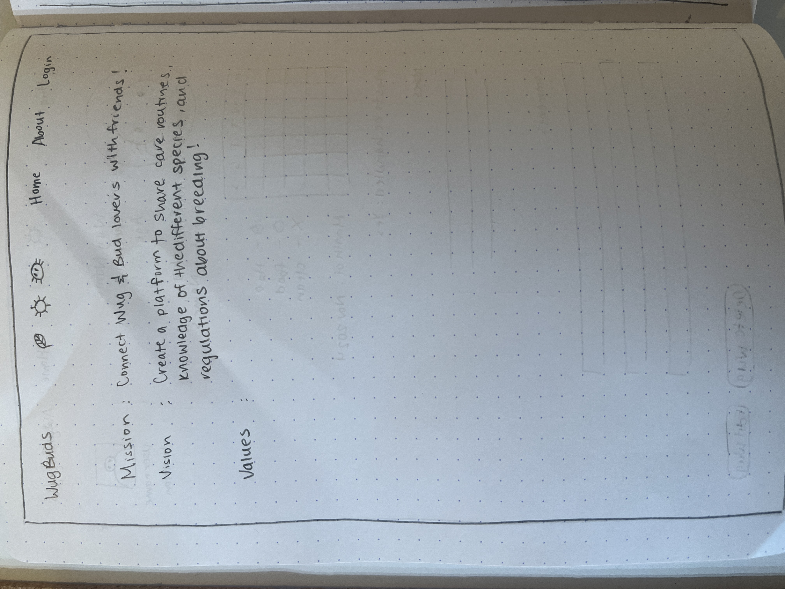
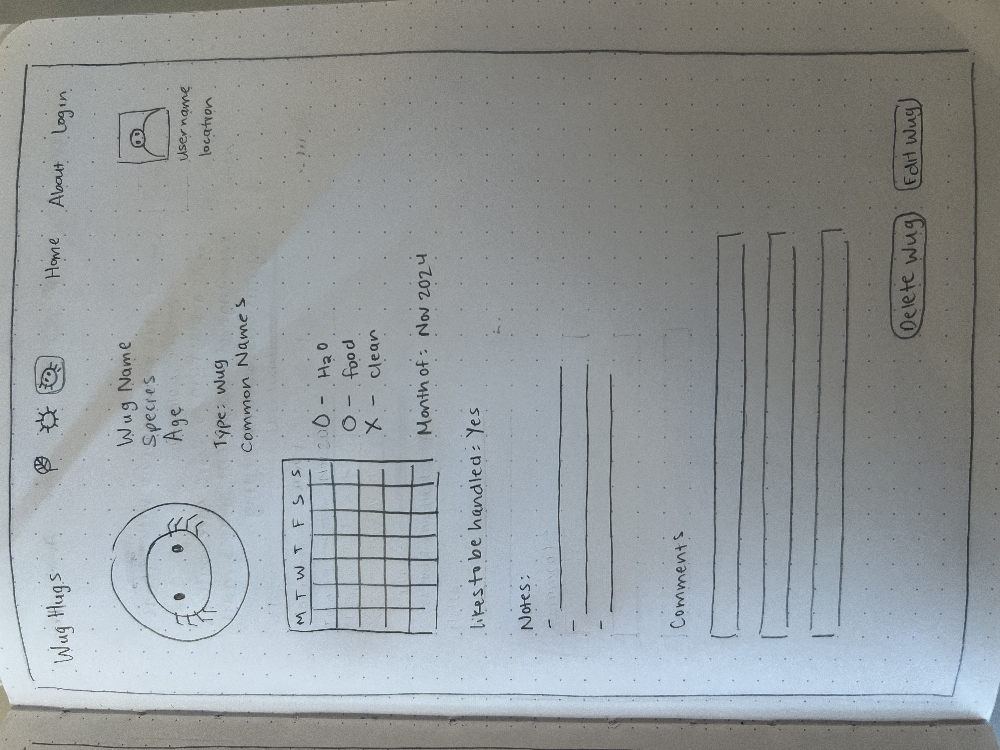

# BRAINSTATION CAPSTONE PROJECT
# Project Title
WugHugs

## Overview

WugHugs is a platform designed wug friends (owners of unconventional pets such as different arachnids, insects, etc.) to create a profile, add their pet(s), and keep an online record/journal of how they care for the pets with the goal of sharing different techniques with other pet owners. 

### Problem

It can be hard and overwhelming to find a comprehensive and approachable guide for how to care for unconventional pets. The WugHugs journal is a great entry point for those that are new to caring for wugs, and can expose people to different ways of caring for their pets. It is also a really fun hobby, and keeping a record of your pets, their growth, and any other details can feel very rewarding and fun! 

### User Profile

- People curious about what it would be like to own different wugs
- Wug owners

### Features

- As a user, I want to be able to explore different wugs
- As a user, I want to be able to create a profile
- As a user with a profile, I want to be able to add wugs to my profile (with different details and an image!)
- As a user with a profile, I want to be able to keep a journal for each wug
_ As a user, I want to be able to comment on other people's wugs

## Implementation

### Tech Stack

- React
- JavaScript
- MySQL
- Express
- Client libraries: 
    - react
    - react-router
    - axios
    - sass
- Server libraries:
    - knex
    - express
    - cors
    - uuid

### APIs

No external APIs will be used for the initial implementation.

### Sitemap

### Home page

### About page

### Login page

### User Profile page

### Add Wug page

### Wug details page

### Mockups

- Home page
- About page
- Create a profile page
- User login page
- User profile page
- Wug details page

### Data

The database will include the following tables:
- Users (id, name, location)
- Wugs (id, user_id, name, species, common_names)

### Endpoints

GET /api/users
- Get all users

Response:

GET /api/users/{userId}
- Get user by ID

Response:

GET /api/users/{userId}/pets
- Get all user wugs

Response:

POST /api/users
- Add a user

Request body:

Response:

POST /api/users/{userId}/pets
- Add a wug

Request body:

Response:

### Auth

No authentication will be implemented in the initial version.

## Roadmap

1. Set up React project with Vite
2. Create Express server and set up routes (users, wugs, user comments)
3. Set up MySQL database and create migrations
4. Create Home Page
5. Create About Page
6. Create a create profile page
7. Create user login page
8. Create user profile page
8. Create wug details page
9. Add styling
10. Testing and bug fixes
11. Deployment

## Nice-to-haves

- Friend request feature
- Big picture, this platform would also be a great resource for people interested in recretional breeding for different wugs. For this, a source of truth for different regulation around this would be created, and a messaging system so that people can connect with users who have species they are interested in crossing. In addition, maybe there would be a blog feature to inform users of safe crossing practices, information unique to individual species, and care. 
- Having a plant-equivalent to this platform under the name BudBuddies that would have the same functionality, but be more targeted to owners of plants who are interested in their care and crossing them.

## How to run

- npm i
- npm run dev